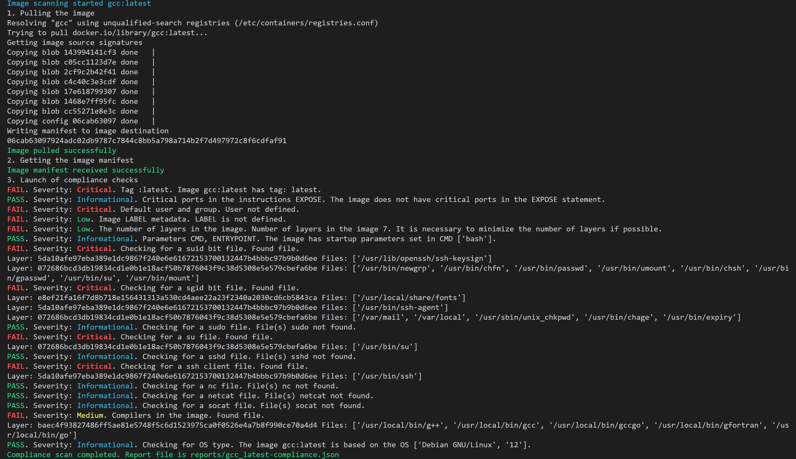

# OCI-image-compliance-scanner

Инструмент для проверки  OCI образов на набор комплаенс требований.

## Используемые инструменты

| Функционал                    | Инструмент | Описание                                                                                                                             |
| --------------------------------------- | -------------------- | -------------------------------------------------------------------------------------------------------------------------------------------- |
| Загрузка артефактов   | podman               | Работа с удаленным регистри (Скачивание образов, аутентификация в регистри) |
| Скрипты сканирования | python               | Работа со слоями, комплаенс проверки, формирование .json файла отчёта                  |

## Использование

Инструмент является независимой процессной единицей, принимающей на вход полный URL до сканируемого образа и данные для аутентификации в удаленном регистри.
По умолчанию .json артефакт отчёта сохраняется по пути $PWD/\$COMPIANCE_REPORTS_DIR/*.json

**Для использования необходимо задать следующие переменные:**

| Переменная      | Описание                                                                      | Использование                                                                                                                                                                                                                     |
| ------------------------- | ------------------------------------------------------------------------------------- | ---------------------------------------------------------------------------------------------------------------------------------------------------------------------------------------------------------------------------------------------- |
| DOCKER_AUTH_CONFIG        | Переменная с конфигурацией доступа к регистри | Аутентификация<br />в регистри через переменную окружения DOCKER_AUTH_CONFIG<br />См. документацию Docker по структуре данных данной переменной |
| COMPLIANCE_IMAGE_FULL_REF | Полный путь до образа                                               | Указание образа для сканирования<br />COMPLIANCE_IMAGE_FULL_REF: "docker.io/image:tag"                                                                                                                           |

**Опциональные переменные:**

| Переменная    | Описание                                                                  | Использование                                                                                             |
| ----------------------- | --------------------------------------------------------------------------------- | ---------------------------------------------------------------------------------------------------------------------- |
| COMPLIANCE_REPORTS_DIR  | Директория с отчётами<br />По умолчанию "reports"   | Рекомендуется оставить по умолчанию                                                    |
| COMPLIANCE_JSON_STDOUT  | Вывод JSON отчёта в STDOUT                                           | COMPLIANCE_JSON_STDOUT: "true"                                                                                         |
| INFORMATIONAL_EXIT_CODE | EXIT CODE при макс. severity INFORMATIONAL<br />По умолчанию 0 | Задать exit code в зависимости от<br /> необходимого параметра security gate |
| LOW_EXIT_CODE           | EXIT CODE при макс. severity LOW<br />По умолчанию 15          | Задать exit code в зависимости от<br />необходимого параметра security gate  |
| MEDIUM_EXIT_CODE        | EXIT CODE при макс. severity MEDIUM<br />По умолчанию 14       | Задать exit code в зависимости от<br /> необходимого параметра security gate |
| HIGH_EXIT_CODE          | EXIT CODE при макс. severity HIGH<br />По умолчанию 13         | Задать exit code в зависимости от<br /> необходимого параметра security gate |
| CRITICAL_EXIT_CODE      | EXIT CODE при макс. severity CRITICAL<br />По умолчанию 12     | Задать exit code в зависимости от<br /> необходимого параметра security gate |

**EXIT CODES:**

| Код завершения | Описание                                                                                                                                                                     |
| :-------------------------: | ------------------------------------------------------------------------------------------------------------------------------------------------------------------------------------ |
|         **0**         | Сканирование пройдено.<br />Наивысшее Severity: **INFORMATIONAL**                                                                                 |
|        **12**        | Сканирование не пройдено.<br />Наивысшее Severity в результатах: **CRITICAL**                                                       |
|        **13**        | Сканирование не пройдено.<br />Наивысшее Severity в результатах: **HIGH**                                                           |
|        **14**        | Сканирование не пройдено.<br />Наивысшее Severity в результатах: **MEDIUM**                                                         |
|        **15**        | Сканирование не пройдено.<br />Наивысшее Severity в результатах: **LOW**                                                            |
|        **20**        | Не удалось скачать образ<br />(Ошибка в имени, регистри, не указаны данные для аутентификации и т.д ...) |
|        **21**        | Не получилось получить метаданные образа                                                                                                         |
|        **22**        | Не определён образ в переменной**COMPLIANCE_IMAGE_FULL_REF**                                                                                        |
|        **23**        | Не удалось создать директорию для сохранения отчётов                                                                                   |

**Пример команды для запуска проверок локально:**

```
docker run -ti -e COMPLIANCE_IMAGE_FULL_REF="image:tag" image_compliance_scanner:v1
```

## Список проверок

| № | Требование                                                                                                                                                                                                                                                                                                                                                                                                                                                        | Критичность | Описание<br />Нарушения                                                                                                                                                               | Проверка                                                                                                                                                                                                                                                                                                           | Ожидаемый<br />результат                                                                                                        |
| :- | --------------------------------------------------------------------------------------------------------------------------------------------------------------------------------------------------------------------------------------------------------------------------------------------------------------------------------------------------------------------------------------------------------------------------------------------------------------------------- | ---------------------- | ------------------------------------------------------------------------------------------------------------------------------------------------------------------------------------------------------ | -------------------------------------------------------------------------------------------------------------------------------------------------------------------------------------------------------------------------------------------------------------------------------------------------------------------------- | ------------------------------------------------------------------------------------------------------------------------------------------------- |
| 1  | Образ не должен иметь тег :latest                                                                                                                                                                                                                                                                                                                                                                                                                      | Critical               | тег != :latest                                                                                                                                                                                      | Анализ значения тега в имени образа<br />image:tag<br />tag != "latest"                                                                                                                                                                                                                      | Тег образа не latest                                                                                                                   |
| 2  | Образ не должен содержать объявление (EXPOSE) служебных портов:<br />- 22 (ssh)<br />- 23 (telnet)<br />- 2375 (docker)<br />- 2376 (docker)                                                                                                                                                                                                                                                                                 | High                   | EXPOSE содержит среди значений порты 22,23,2375,2376                                                                                                                         | Анализ значения инструкции EXPOSE в метаданных образа<br />EXPOSE не содержит 22,23,2375,2376                                                                                                                                                                         | EXPOSE не содержит "критичных" портов""                                                                                  |
| 3  | Образ не должен быть с пользователем root и группой root по умолчанию. Должен присутствовать<br />пользователь отличный от root с группой отличной от root,<br />а так же прописан как пользователь по умолчанию инструкцией USER при сборке в Dockerfile<br />Напр. <br />USER app:app     | Critical               | Отсутствует пользователь в образе отличный от root<br />Пользователь отличный от root не прописан в инструкции USER | Анализ значения инструкции USER в метаданных образа<br />USER не содержит значения <br />"root"<br />"0"<br />Как для пользователя так и для группы.<br />USER состоит из двух значений<br />user:group  | USER прописан явно, так же прописана группа<br />Например<br />USER user:group<br />И != root или '0' |
| 4  | Образ должен содержать (Label) метку или набор меток, содержащий информацию о:<br />- Производителе (Название компании, email)<br />- Версии (Версии и/или номере сборки)<br />- Названии компонента в составе АС (Например: component=backend)<br />- Названии АС (Например: product=juiceshop) | Low                    | Отсутствие LABEL                                                                                                                                                                             | Анализ отсутствия инструкции LABEL в метаданных образа                                                                                                                                                                                                                         | LABEL прописан явно                                                                                                                   |
| 5  | Образ должен содержать только 1 результирующий слой                                                                                                                                                                                                                                                                                                                                                                             | Low                    | Образ состоит более чем из 1 слоя                                                                                                                                           | Анализ количества слоёв в составе образа                                                                                                                                                                                                                                                | Образ состоит из одного слоя                                                                                              |
| 6  | В образе должен быть явно прописан ENTRYPOINT или CMD                                                                                                                                                                                                                                                                                                                                                                                       | Low                    | Не задана ни одна из инструкций ENTRYPOINT или CMD                                                                                                                        | Анализ значения инструкции ENTRYPOINT, CMD в метаданных образа                                                                                                                                                                                                                   | В образе заданы параметры запуска в инструкциях ENTRYPOINT или CMD                                    |
| 7  | Образ не должен содержать файлы с битами SUID                                                                                                                                                                                                                                                                                                                                                                                             | Critical               | В образе и слоях присутствуют файлы с битами SUID                                                                                                                 | Поиск файлов с битами SUID в слоях образа                                                                                                                                                                                                                                                   | В слоях образа отсутствуют файлы с битами SUID                                                                 |
| 8  | Образ не должен содержать файлы с битами SGID                                                                                                                                                                                                                                                                                                                                                                                             | Critical               | В образе и слоях присутствуют файлы с битами SGID                                                                                                                 | Поиск файлов с битами SGID в слоях образа                                                                                                                                                                                                                                                    | В слоях образа отсутствуют файлы с битами SGID                                                                 |
| 9  | Образ не должен содержать программы позволяющие повысить привилегии (su)                                                                                                                                                                                                                                                                                                                                        | Critical               | В образе и слоях присутствует файл su                                                                                                                                   | Поиск исполняемого файла su в слоях образа.                                                                                                                                                                                                                                            | В слоях образа отсутствует исполняемый файл su                                                            |
| 10 | Образ не должен содержать программы позволяющие повысить привилегии (sudo)                                                                                                                                                                                                                                                                                                                                      | Critical               | В образе и слоях присутствует файл sudo                                                                                                                                 | Поиск исполняемого файла sudo в слоях образа.                                                                                                                                                                                                                                           | В слоях образа отсутствует исполняемый файл sudo                                                          |
| 11 | Образ не должен содержать программы удаленного доступа по сети (sshd)                                                                                                                                                                                                                                                                                                                                                 | Critical               | В образе установлен sshd                                                                                                                                                              | Поиск исполняемого файла sshd в слоях образа                                                                                                                                                                                                                                             | В слоях образа отсутствует исполняемый файл sshd                                                           |
| 12 | Образ не должен содержать программы удаленного доступа по сети (ssh client)                                                                                                                                                                                                                                                                                                                                           | Critical               | В образе установлен ssh клиент                                                                                                                                                  | Поиск исполняемого файла ssh в слоях образа                                                                                                                                                                                                                                              | В слоях образа отсутствует исполняемый файл ssh                                                             |
| 13 | Образ не должен содержать программы удаленного доступа по сети (netcat)                                                                                                                                                                                                                                                                                                                                               | Critical               | В образе установлен netcat                                                                                                                                                            | Поиск исполняемого файла netcat в слоях образа                                                                                                                                                                                                                                           | В слоях образа отсутствует исполняемый файл netcat                                                         |
| 14 | Образ не должен содержать программы удаленного доступа по сети (socat)                                                                                                                                                                                                                                                                                                                                                | Critical               | В образе установлен socat                                                                                                                                                             | Поиск исполняемого файла socat в слоях образа                                                                                                                                                                                                                                           | В слоях образа отсутствует исполняемый файл socat                                                          |
| 15 | В образе должны отсутствовать компиляторы (gcc, gccgo, gc, go ...)                                                                                                                                                                                                                                                                                                                                                                    | Medium                 | В образе присутствуют компиляторы                                                                                                                                        | Поиск известных компиляторов в ФС образа по имени исполняемого файла                                                                                                                                                                                            | В образе отсутствуют компиляторы                                                                                     |

### Пример вывода сканирования в stdout



### Пример результатов сканирования в формате .json

```json
{
    "gcc:latest": [
        {
            "Title": "Tag :latest",
            "Severity": "Critical",
            "Pass": false,
            "Description": "Image gcc:latest has tag: latest",
            "Mitigation": "The image must have a fixed tag to determine the version"
        },
        {
            "Title": "Critical ports in the instructions EXPOSE",
            "Severity": "Informational",
            "Pass": true,
            "Description": "The image does not have critical ports in the EXPOSE statement",
            "Mitigation": "Make sure your containers only use protocols for remote connectivity when necessary."
        },
        {
            "Title": "Default user and group",
            "Severity": "Critical",
            "Pass": false,
            "Description": "User not defined",
            "Mitigation": "The default USER and GROUP must be explicitly defined in the USER statement and do not contain root or 0. For example, USER app:app"
        },
        {
            "Title": "Image LABEL metadata",
            "Severity": "Low",
            "Pass": false,
            "Description": "LABEL is not defined",
            "Mitigation": "The image must contain a set of labels specified by the developer in the LABEL instruction"
        },
        {
            "Title": "The number of layers in the image",
            "Severity": "Low",
            "Pass": false,
            "Description": "Number of layers in the image 7. It is necessary to minimize the number of layers if possible",
            "Mitigation": "A good practice would be to squash all layers in the resulting image into a single layer. See docker squash, multistage build"
        },
        {
            "Title": "Parameters CMD, ENTRYPOINT",
            "Severity": "Informational",
            "Pass": true,
            "Description": "The image has startup parameters set in CMD ['bash']",
            "Mitigation": "It is good practice to specify default launch parameters by developer. You must define parameters in a CMD or ENTRYPOINT statement"
        },
        {
            "Title": "Checking for a suid bit file",
            "Severity": "Critical",
            "Pass": false,
            "Description": "Found file",
            "Mitigation": "The image must not contain file(s) suid bit in the image",
            "Files": [
                {
                    "5da10afe97eba389e1dc9867f240e6e61672153700132447b4bbbc97b9b0d6ee": [
                        "/usr/lib/openssh/ssh-keysign"
                    ]
                },
                {
                    "072686bcd3db19834cd1e0b1e18acf50b7876043f9c38d5308e5e579cbefa6be": [
                        "/usr/bin/newgrp",
                        "/usr/bin/chfn",
                        "/usr/bin/passwd",
                        "/usr/bin/umount",
                        "/usr/bin/chsh",
                        "/usr/bin/gpasswd",
                        "/usr/bin/su",
                        "/usr/bin/mount"
                    ]
                }
            ]
        },
        {
            "Title": "Checking for a sgid bit file",
            "Severity": "Critical",
            "Pass": false,
            "Description": "Found file",
            "Mitigation": "The image must not contain file(s) sgid bit in the image",
            "Files": [
                {
                    "e8ef21fa16f7d8b718e156431313a530cd4aee22a23f2340a2030cd6cb5843ca": [
                        "/usr/local/share/fonts"
                    ]
                },
                {
                    "5da10afe97eba389e1dc9867f240e6e61672153700132447b4bbbc97b9b0d6ee": [
                        "/usr/bin/ssh-agent"
                    ]
                },
                {
                    "072686bcd3db19834cd1e0b1e18acf50b7876043f9c38d5308e5e579cbefa6be": [
                        "/var/mail",
                        "/var/local",
                        "/usr/sbin/unix_chkpwd",
                        "/usr/bin/chage",
                        "/usr/bin/expiry"
                    ]
                }
            ]
        },
        {
            "Title": "Checking for a sudo file",
            "Severity": "Informational",
            "Pass": true,
            "Description": "File(s) sudo not found",
            "Mitigation": "The image must not contain file(s) sudo in the image"
        },
        {
            "Title": "Checking for a su file",
            "Severity": "Critical",
            "Pass": false,
            "Description": "Found file",
            "Mitigation": "The image must not contain file(s) su in the image",
            "Files": [
                {
                    "072686bcd3db19834cd1e0b1e18acf50b7876043f9c38d5308e5e579cbefa6be": [
                        "/usr/bin/su"
                    ]
                }
            ]
        },
        {
            "Title": "Checking for a sshd file",
            "Severity": "Informational",
            "Pass": true,
            "Description": "File(s) sshd not found",
            "Mitigation": "The image must not contain file(s) sshd in the image"
        },
        {
            "Title": "Checking for a ssh client file",
            "Severity": "Critical",
            "Pass": false,
            "Description": "Found file",
            "Mitigation": "The image must not contain file(s) ssh client in the image",
            "Files": [
                {
                    "5da10afe97eba389e1dc9867f240e6e61672153700132447b4bbbc97b9b0d6ee": [
                        "/usr/bin/ssh"
                    ]
                }
            ]
        },
        {
            "Title": "Checking for a nc file",
            "Severity": "Informational",
            "Pass": true,
            "Description": "File(s) nc not found",
            "Mitigation": "The image must not contain file(s) nc in the image"
        },
        {
            "Title": "Checking for a netcat file",
            "Severity": "Informational",
            "Pass": true,
            "Description": "File(s) netcat not found",
            "Mitigation": "The image must not contain file(s) netcat in the image"
        },
        {
            "Title": "Checking for a socat file",
            "Severity": "Informational",
            "Pass": true,
            "Description": "File(s) socat not found",
            "Mitigation": "The image must not contain file(s) socat in the image"
        },
        {
            "Title": "Compilers in the image",
            "Severity": "Medium",
            "Pass": false,
            "Description": "Found file",
            "Mitigation": "The image should not contain compilers in the file system, except when they are necessary for the operation of the application. Make sure that compilers are actually needed during execution",
            "Files": [
                {
                    "baec4f93827486ff5ae81e5748f5c6d1523975ca0f0526e4a7b8f990ce70a4d4": [
                        "/usr/local/bin/g++",
                        "/usr/local/bin/gcc",
                        "/usr/local/bin/gccgo",
                        "/usr/local/bin/gfortran",
                        "/usr/local/bin/go"
                    ]
                }
            ]
        },
        {
            "Title": "Checking for OS type",
            "Severity": "Informational",
            "Pass": true,
            "Description": "The image gcc:latest is based on the OS ['Debian GNU/Linux', '12']",
            "Mitigation": "A good practice would be to use Distroless images to minimize the components in the image"
        }
    ]
}
```
